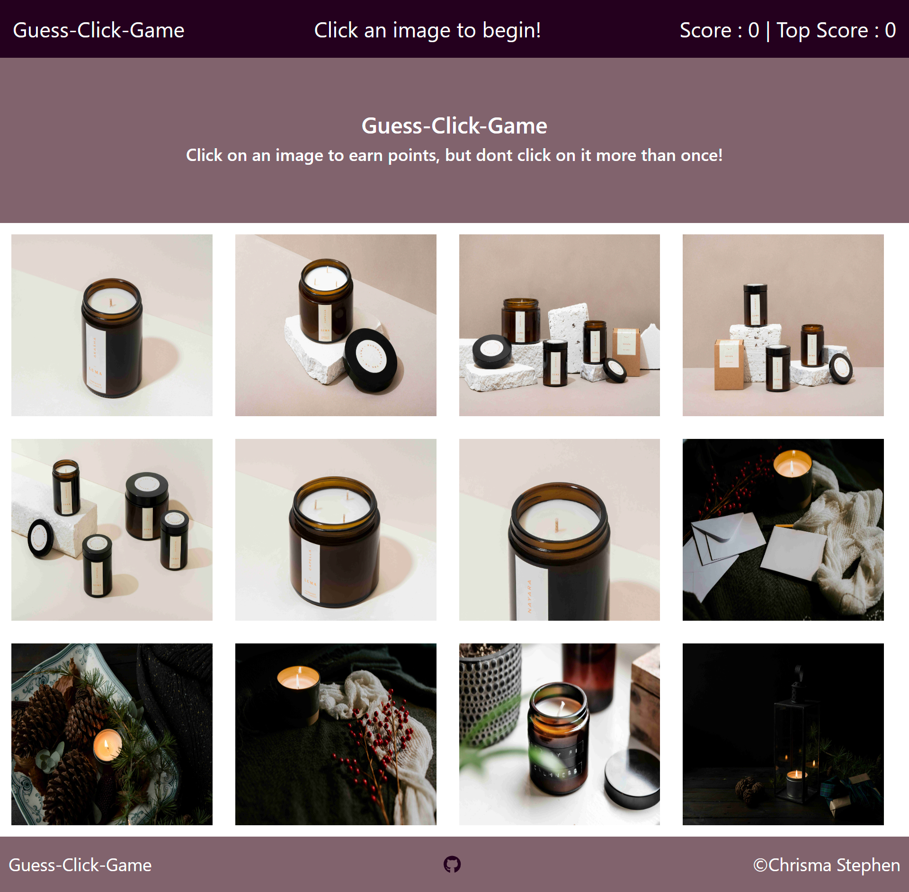

# Guess-Click-Game

## About the Project

The Guess-Click-Game captivating game leverages the power of React, a renowned JavaScript library, to create a dynamic and responsive user experience. The seamless score updates, randomized image arrangements, and top score tracking are all dynamically managed through React's efficient use of hooks, props, and components. Such a setup ensures a fluid and engaging interaction, encouraging players to improve their memory through repeated plays.

Upon initiation, the game presents a collection of 12 images to the player. Interaction begins with a simple click on any of these images, triggering the scoring mechanism. Each unique image clicked increments the player's score, propelling them towards achieving a new high score. However, the challenge intensifies as a repeated click on any previously selected image resets the score to zero, urging the player to start anew with a fresh strategy. The game meticulously records the highest score achieved in a session as the "Top Score," which only escalates when the player surpasses their previous best, adding a competitive edge to the gameplay.

The visual aspect of the game draws upon a selection of images sourced from Unsplash, ensuring high-quality and diverse visuals to keep the gameplay interesting. The aesthetic appeal of the game is further enhanced by styling achieved through CSS, Bootstrap, and React-Bootstrap. The color scheme, carefully selected from Coolors.co, complements the overall design, creating an inviting and stimulating environment for the game.

In conclusion, the Guess-Click-Game stands as a testament to thoughtful design and software engineering principles, offering users an enjoyable and mentally stimulating experience. Its development showcases the versatility and efficiency of React for building interactive web applications and highlights the importance of thoughtful user interface design and the impactful use of visual elements.

## Built with

This repository has been built using 

=React
-React Bootstrap
-HTML
-CSS 
-Javascript
-Git 
-Github 
-Netlify

## Collaboration

I love would to hear your feedback on the game, the user experience and the user interface. If you would like to connect, please drop me an email at chrismacaroline@gmail.com

## Resources:
- https://unsplash.com/photos/white-paper-on-white-textile-NU_rR7TgE-M?utm_content=creditShareLink&utm_medium=referral&utm_source=unsplash - Kelly Sikkema
- https://unsplash.com/photos/white-and-black-labeled-bottle-ldRGBNFkkqo?utm_content=creditShareLink&utm_medium=referral&utm_source=unsplash - Luma Candles
-https://unsplash.com/photos/clear-glass-candle-holder-with-brown-liquid-TBNzDilPfzo?utm_content=creditShareLink&utm_medium=referral&utm_source=unsplash -Dan Smedley
-https://unsplash.com/photos/tealight-candle-with-rack-inside-glass-lantern-MDY8nnzMJn4?utm_content=creditShareLink&utm_medium=referral&utm_source=unsplash - Joanna Kosinska
- https://coolors.co/

### Installation

This game can be played by visiting the url : https://guessclickgame.netlify.app/
The code can be viewed at github: https://github.com/chrisma89/Guess-Click-Game

### Usage

Dive into a quick mental refreshment anytime with this React-powered memory game, designed to sharpen your focus and enhance recall with just a few clicks.
The screenshot of the webpage is below : 

### Credits
- Thank you to the curriculum team behind bootcampspot for the inspiration.
- Massive Thanks to the authors of the images that are in use in the application.

### Licence
The standard MIT Licence is in use for this repository.
